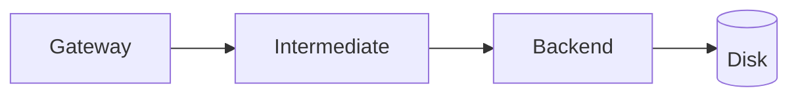

# Quarkus/JAX-RS API Gateway
This is a demonstrator for issues chaining services together without needing to buffer responses in memory.

# Overview
The general architecture should consist of three resources, all sharing the same/similar interfaces that
forward the request to the next resource with minimal buffering. In the real-world implementation the
Gateway is responsible for authentication, the Intermediate service is responsible for auditing/logging, and
the backend service is responsible for a lot of different things alongside writing to disk

## Architecture
